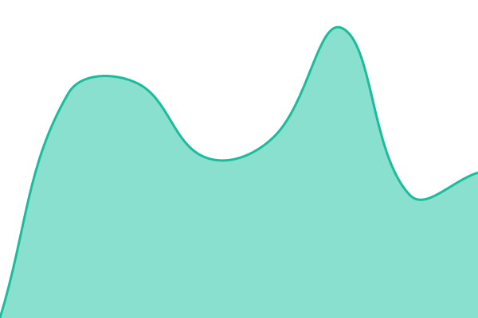

# [📈 Live Status](https://status.fondaro.com): <!--live status--> **🟧 Partial outage**

This repository contains the open-source uptime monitor and status page for [fondaro](https://status.fondaro.com), powered by [Upptime](https://github.com/upptime/upptime).

With [Upptime](https://upptime.js.org), you can get your own unlimited and free uptime monitor and status page, powered entirely by a GitHub repository. We use [Issues](https://github.com/fondaro/status/issues) as incident reports, [Actions](https://github.com/fondaro/status/actions) as uptime monitors, and [Pages](https://status.fondaro.com) for the status page.

<!--start: status pages-->
<!-- This summary is generated by Upptime (https://github.com/upptime/upptime) -->
<!-- Do not edit this manually, your changes will be overwritten -->
<!-- prettier-ignore -->
| URL | Status | History | Response Time | Uptime |
| --- | ------ | ------- | ------------- | ------ |
|  [Marketing site](https://fondaro.com) | 🟩 Up | [marketing-site.yml](https://github.com/fondaro/status/commits/HEAD/history/marketing-site.yml) | 

 314ms
     
 | 

<a href="https://status.fondaro.com/history/marketing-site">100.00%</a>
    

|  [Dashboard](https://fondaro.com/dashboard) | 🟥 Down | [dashboard.yml](https://github.com/fondaro/status/commits/HEAD/history/dashboard.yml) | 

 364ms
     
 | 

<a href="https://status.fondaro.com/history/dashboard">30.77%</a>
    

|  [API](https://api.fondaro.com/health) | 🟩 Up | [api.yml](https://github.com/fondaro/status/commits/HEAD/history/api.yml) | 

 305ms
     
 | 

<a href="https://status.fondaro.com/history/api">100.00%</a>
    

|  [Sanity Studio](https://studio.fondaro.com) | 🟥 Down | [sanity-studio.yml](https://github.com/fondaro/status/commits/HEAD/history/sanity-studio.yml) | 

 0ms
     
 | 

<a href="https://status.fondaro.com/history/sanity-studio">80.59%</a>
    

<!--end: status pages-->

[**Visit our status website →**](https://status.fondaro.com)

## 📄 License

- Powered by: [Upptime](https://github.com/upptime/upptime)
- Code: [MIT](./LICENSE) © [Anand Chowdhary](https://anandchowdhary.com)
- Data in the `./history` directory: [Open Database License](https://opendatacommons.org/licenses/odbl/1-0/)
